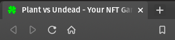
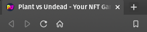

# Favicon for Plants vs undead website.
I notice the website doesn't have a favicon so I made two. 
I really like the game, I'm not expecting anything in return, but I will leave the wallet anyways.

**BNB wallet**
0x65a64d4c7B5BeE54be681ca8b10E186718Be2fE6

### Clover

### PVU Circle



# Setup
### The website is awesome, of course you don't need me to explain how to add a favicon.
### Here's the explanation anyways.


Place the files in the root directory of your website.

- android-chrome-192x192.png
- android-chrome-512x512.png
- apple-touch-icon.png
- favicon-16x16.png
- favicon-32x32.png
- favicon.ico
- site.webmanifest


Next, copy the following link tags and paste them into the **head** of your HTML.

```
<link rel="apple-touch-icon" sizes="180x180" href="/apple-touch-icon.png">
<link rel="icon" type="image/png" sizes="32x32" href="/favicon-32x32.png">
<link rel="icon" type="image/png" sizes="16x16" href="/favicon-16x16.png">
<link rel="manifest" href="/site.webmanifest">
```

Add favicon to PVU website.
